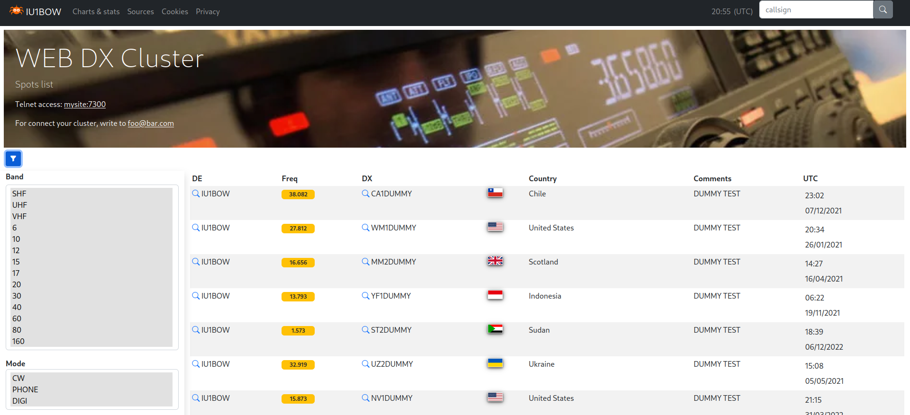
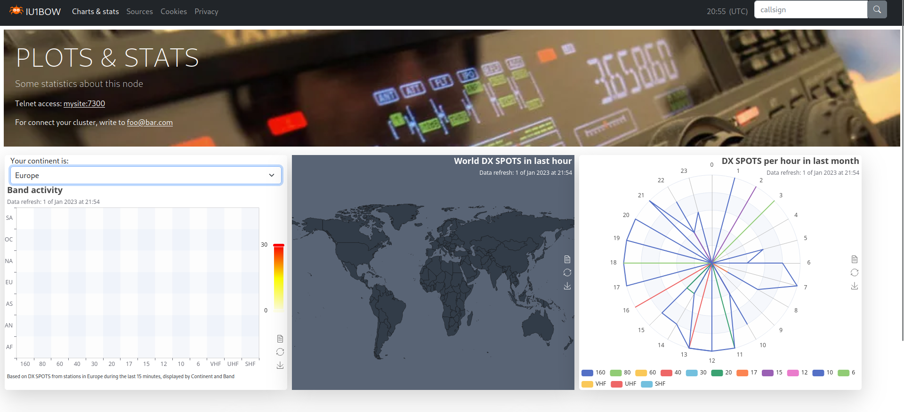
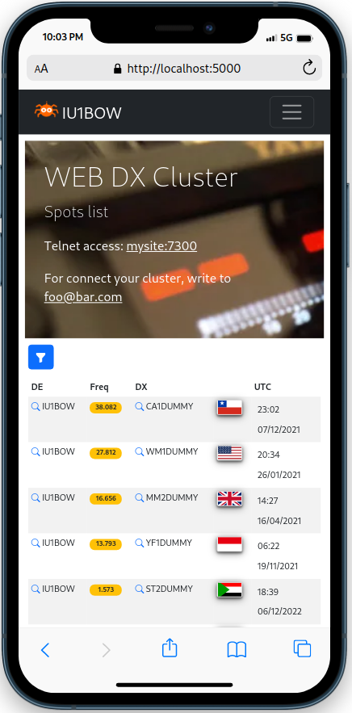
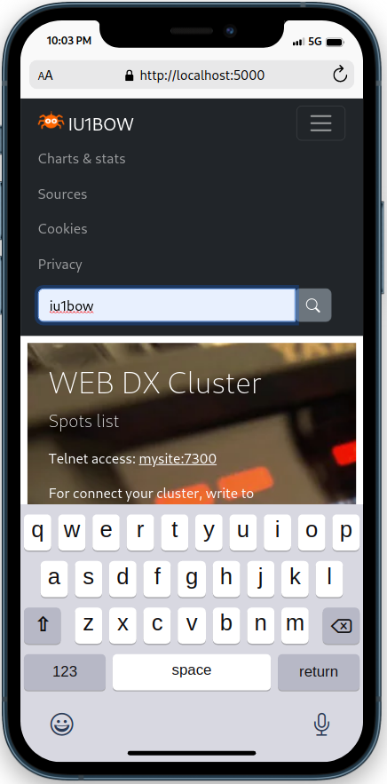
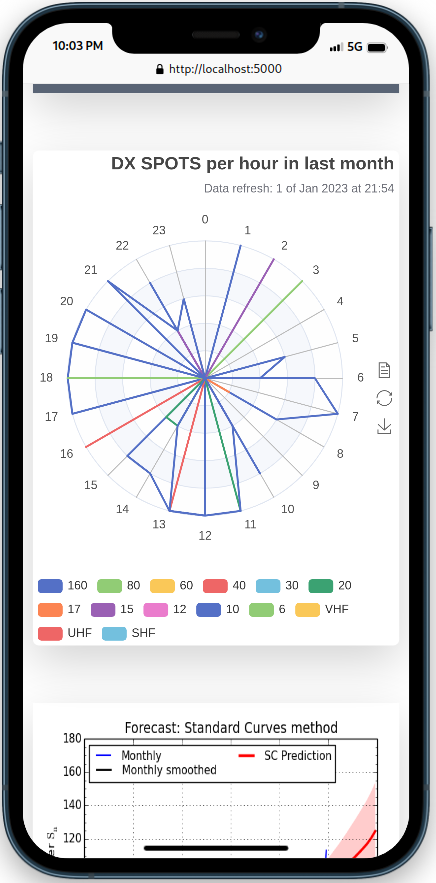
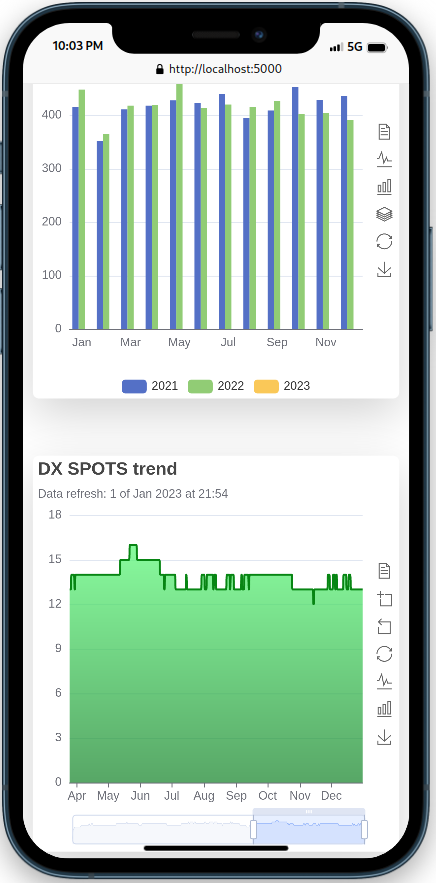

 SPIDERWEB
===

### Ham radio cluster web viewer for DxSpider
[](http://perso.crans.org/besson/LICENSE.html)
[](https://www.python.org/)
[](https://www.javascript.com)
[](https://getbootstrap.com/)
[](https://www.codefactor.io/repository/github/coulisse/spiderweb)


- **Release:** v2.5.3
- **Author:** Corrado Gerbaldo - [IU1BOW](https://www.qrz.com/db/IU1BOW)
- **Mail:** <corrado.gerbaldo@gmail.com>
- **Licensing:** Gpl V3.0 see [LICENSE](LICENSE) file.
- **Languages:** This application is written in Python 3.11/flask,Javascript and HTML

___
**DXSpider** is a great DX Cluster software that has useful telnet interface. 
I wrote this application in order to add a web user interface to DXSpider and show the spots collected.
The user could see 50 spots at time and filter them by band, spotter continent and spotted continent.

For this application, I've used:
- **Bootstrap** for stylesheet CSS
- **Apache ECharts** for managing charts
- **qrz.com** For each callsing, found you can click on lens and you'll see him on qrz.com
- **flag-icon-css** [https://github.com/lipis/flag-icon-css](https://github.com/lipis/flag-icon-css) I used it to show the country flags 
- **ng3k.com** [ng3k.com](http://ng3k.com/misc/adxo.html) I used to get information about "Announced Dx Operations". Thanks to Bill/NG3K !!!
- **silso** [sidc.be/silso](https://sidc.be/silso/) used to show propagation trend in "Chart & stats" section
- **hamqsl** [www.hamqsl.com/solar.html](https://www.hamqsl.com/solar.html/) used to show solar and band conditions
- **kc2g** [prop.kc2g.com](https://prop.kc2g.com/) used to show MUF map


You can find my web site at [https://www.iu1bow.it](https://www.i1bow.it)

### Changelog
see file ["CHANGELOG.md"](docs/CHANGELOG.md)

### Install            

**1) DXSpider**
First of all you have to installed [DXspider](http://www.dxcluster.org/) and connected with some other cluster nodes.

**2) MariaDB / MySQL**
Then you have to install MariaDB on your web server, on the same server where DXSpider is running and configure DXSpider to use it: in your spider folder edit `local/DXVars.pm` adding these lines:
```DXWars.pm
# the SQL database DBI dsn
$dsn = "dbi:mysql:dxcluster:localhost:3306";
$dbuser = "your-user";
$dbpass = "your-password"; 
```
If you would change some MariaDB parameters, then you can find them in  `/etc/mysql/my.cnf` or `/etc/my.cnf`, depending on your distro.
If the database will not be created automatically, please see ["DB_ISSUES.md"](docs/DB_ISSUES.md) 

**3) Python modules**  
You could install python modules using automatic or manual way.

*3.1) Automatic modules install*  
after downloaded spiderweb move in the main folder and install using requirements.txt file
```console
 foo@bar:~$ cd spiderweb                                
 foo@bar:~$ pip install -r requirements.txt
```
*3.2) Manual modules install*  
First of all you have to install the python3 pip installer
```console
foo@bar:~$ sudo apt install python3-pip
```
This application is based on Flask 
To install **Flask**:
```console
foo@bar:~$ pip install flask 
foo@bar:~$ pip install Flask-minify
foo@bar:~$ pip install flask_wtf
foo@bar:~$ pip install pandas
```
Then you have to install mysql libraries**:
```console
foo@bar:~$ pip install mysql-connector-python
foo@bar:~$ pip install --upgrade mysql-connector-python==8.0.12

```

### Configuration  

In the path `spiderweb/cfg/` rename `config.json.template` in `config.json`:
```console
foo@bar:~$ mv config.json.template config.json
```
then edit it and set the user and password of your database, the menu items, and other stuffs (callsign, mail address...).
There is also a specific parameter, named "enable_cq_filter" used to enable the CQ Zone filtering.

Othewhise, if you prefer, you could use a utility to edit your configuration and menu. Go in "script" folder and run ./config.sh

```console
foo@bar:~$ cd scripts
foo@bar:~$ ./config.sh

*** DxSpider configuration ***
Configuration file loaded from: ../cfg/config.json

   h:  help
   vc: view config.
   ec: edit config.
   vm: view menu
   em: edit menu
   s:  save
   t:  load config. from template

   x:  exit

Make your choice: 

```

### Crontab
Starting from version 2.4, since all activities are managed by the application, you don't need to schedule anything.


### Run test
Now, you can run your web application with the following command:
```console
foo@bar:~$ python3 webapp.py
```
The flask default port is 5000, so you can see your web app, typing `http://localhost:5000` in your web browser.
Keep in mind that the flask web server, usually is used as a test server.

### Production
There are some ways to use it in production. 

My configuration is:
Cloudflare + Nginx + Bjoern

**Bjoern is a lightweight WSGI for python.**

for installing it: 
```console
foo@bar:~$ sudo apt install libev-dev libevdev2
foo@bar:~$ pip3 install bjoern
```

If you want you can make it as a _daemon service_.
Create and edit a file named for example spiderweb.service (in the systemd folder)

```console
foo@bar:~$ sudo nano /etc/systemd/system/spiderweb.service
```
Below an example of configuration, keep in mind that it is just an example (you have to put your data for your application [here a little guide](https://linuxhandbook.com/create-systemd-services/)   ):
```console
[Unit]
Description=bjoern instance spiderweb
After=network.target
After=multi-user.target

[Service]
User=web
Group=www-data
Type=simple
WorkingDirectory=/home/web/spiderweb
Environment="PATH=/home/web/spiderweb"
ExecStart=/usr/bin/python3 /home/web/spiderweb/wsgi.py

[Install]
WantedBy=multi-user.target
```

Then you can install and start the daemon:
```console
foo@bar:~$ sudo systemctl enable spiderweb.service
foo@bar:~$ sudo systemctl start spiderweb.service
foo@bar:~$ sudo systemctl status spiderweb.service

● spiderweb.service - bjoern instance spiderweb
   Loaded: loaded (/etc/systemd/system/spiderweb.service; enabled; vendor preset: enabled)
   Active: active (running) since Sun 2020-10-25 09:56:35 UTC; 8h ago
 Main PID: 6518 (python3)
    Tasks: 1 (limit: 420)
   CGroup: /system.slice/spiderweb.service
           └─6518 /usr/bin/python3 /home/web/spiderweb/wsgi.py

Oct 25 09:56:35 dxcluster01 systemd[1]: Started bjoern instance spiderweb.
```
Now you can install and configure **NGINX**

Install with:  
```console
foo@bar:~$ sudo apt install nginx
```

Configure:
```console
sudo nano /etc/nginx/sites-available/myapp
```

```console
server {
    listen 80;
    server_name iu1bow.it www.iu1bow.it;
    location ^~ /.well-known/ {
      alias /home/web/verify/.well-known/;
    }

    location / {
        ssi off;
        include proxy_params;
        proxy_pass http://localhost:8080/;
        proxy_set_header Host $host;
    }
}

```

For SSL, I'm using [Cloudflare](https://www.cloudflare.com/). This is a free service that allow you to use https and a proxy cache. 


**Search engine indexing:** when you are on-line, if you would to index your website on search engines, you have to generate a file named sitemap.xml and put it in /static/ folder. There are many tools to generate sitemap.xml, for example [www.xml-sitemaps.com](https://www.xml-sitemaps.com/)

**Index on MySQL:** if you would to increase speed on callsign search, you could define some index on the table 'spot'. You can see more details on ["create_mysql_index.sql"](scripts/create_mysql_index.sql)


### Mobile
This application is designed for desktop and mobile phone. It is a [PWA](https://en.wikipedia.org/wiki/Progressive_web_app), so it could be installed and used like an app on mobile.

### API
**Spot list**

You can retrieve last spots calling "**/spotlist**"; For example  [www.iu1bow.it/spotlist](https://www.iu1bow.it/spotlist)

**Country of a callsign**

You can retrive some information about a callsign with **callsign**; for example:  [www.iu1bow.it/callsign?c=IU1BOW](https://www.iu1bow.it/callsign?c=IU1BOW)


### Development
**Directory structure**
```
/                 . main application files
├── cfg           . configuration files (put here your config.json with your setting)
├── docs          . documentation
├── lib           . python libs used for the application
├── log           . application log
├── scripts       . utility scripts for testing, build etc.
├── static        . static files css, js, data, html, images etc.
│   ├── css       .
│   │   ├── dev   . development css not minifyed/uglifyed
│   │   └── rel   . release css minifyed/uglifyed  (do not change these files)
│   ├── data      . application data (world.json)
│   ├── html      .
│   │   └── dev   . html templates used for build release static html (for offline)
│   │   └── rel   . release static html (for offline)
│   ├── images    . static images
│   │   └── icons . static icons
│   └── js        .
│       ├── dev   . development js not minifyed/uglifyed
│       └── rel   . release js minifyed/uglifyed  (do not change these files)
└── templates     . html templates used by python flask for serve the web pages
```
**Application description**

The main **server** application ```webapp.py``` is in the root folder. In this application there are routing to html dynamic templates and serves also back-end API. This is wrapped by ```wsgi.py``` for using with **bjoern** server.

Static files (css, js...) are in ```static``` directory: here there are subdirectories: 
- ```dev```  where you can edit and modify sources
- ```rel```  here there are release files created with the building process and used in production

**Lint**

For lint javascript I use **ESLint**. You can install with ```npm init @eslint/config```
 pylint        ```pip install pylint```

**Building process**

Prerequisites:
| **Component** | **Description**                                    | **Install command**             |
|---------------|----------------------------------------------------|---------------------------------|
| npm           | a packet manager for javascript                                  |  depend on your os. See [official page](https://docs.npmjs.com/downloading-and-installing-node-js-and-npm) |
| uglify-js     | npm component used to minify and uglify javascript | ```npm install uglify-js -g```  |
| css-minify    | npm component used to minify css                   | ```npm install css-minify -g``` |
| staticjinja   | python module used to create static page starting from a html template                | ```pip install staticjinja```   |


You can build the software for test (dev), or for production (release) environments.
In ```scripts``` directory launch:
- ```./build.sh -d``` for dev environment

- ```./build.sh -r``` for release environment


### Screenshots
----------

**desktop**





**mobile**

<p float="left">




</p>

