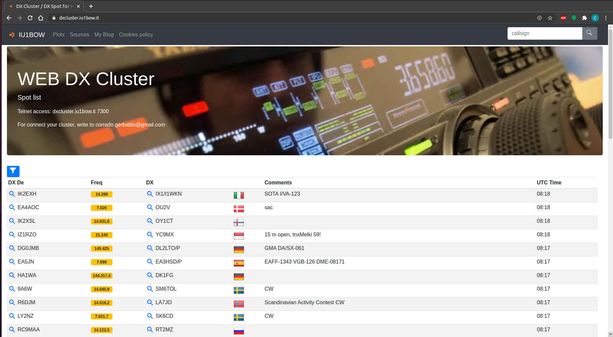
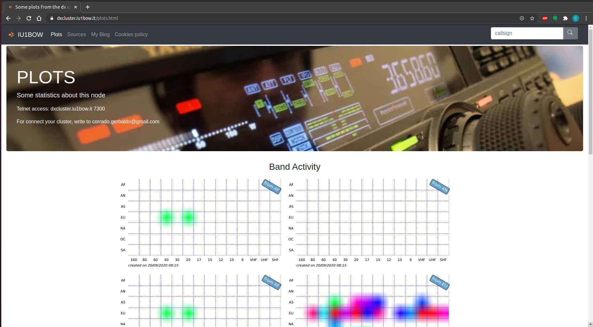

SPIDERWEB
===

### Ham radio cluster web viewer for DxSpider

- **Author:** Corrado Gerbaldo - IU1BOW.
- **Mail:** <corrado.gerbaldo@gmail.com>
- **Licensing:** Gpl V3.0 see ["LICENSE"](LICENSE) file.
- **Languages:** This application is written in Python/flask,Javascript and HTML
___
**DXSpider** is a great DX Cluster software that has a usefull telnet interface. 
I wrote this application in order to add a web user interface to DXSpider and show the spots collected.
The user could see 50 spots at time and filter them by band, spotter continent and spotted continent.

For this application I've used:
- **Bootstrap** for stylesheet CSS
- **Jquery** In the header you can find the link to MS link
- **qrz.com** For each callsing found you can click on lens and you'll see him on qrz.com
- **flag-icon-css** [https://github.com/lipis/flag-icon-css](https://github.com/lipis/flag-icon-css) I used it for show the country flags 
- **cookie-bar.eu** I use it for cookie bar
- **ng3k.com** [ng3k.com](http://ng3k.com/misc/adxo.html) I used to get information about "Announced Dx Operations". Thanks to Bill/NG3K !!!

You can find my web site at [https://www.iu1bow.it](https://www.i1bow.it)

### Changelog
**New Release 2.0.!!!**
It uses Python 3 and Bootstrap 5
see file ["CHANGELOG.md"](docs/CHANGELOG.md)

### Install            

**1) DXSpider**
First of all you have to installed [DXspider] (http://www.dxcluster.org/) and connected with some other cluster nodes.

**2) MariaDB / MySQL**
Then you have to install MariaDB on your web server, on the same server where DXSpider is running and configure DXSpider to use it: in your spider folder edit `local/DXVars.pm` adding these lines:
```DXWars.pm
# the SQL database DBI dsn
$dsn = "dbi:mysql:dxcluster:localhost:3306";
$dbuser = "your-user";
$dbpass = "your-password"; 
```
If you would change some MariaDB parameters, then you can find them in  `/etc/mysql/my.cnf` or `/etc/my.cnf`, depending on your distro.
If the database will not be created automatically, please see ["DB_ISSUES.md"](docs/DB_ISSUES.md) 

**3) Python / Flask**
First of all you have to install the python3 pip installer
```console
foo@bar:~$ sudo apt install python3-pip
```

This application is based on Flask 
To install **Flask**:
```console
foo@bar:~$ pip3 install flask 
```
or
```console
foo@bar:~$ sudo -H pip3 install flask --system 
```
Then you have to install mysql libraries**:
```console
foo@bar:~$ pip3 install flask_mysqldb  
or
foo@bar:~$ sudo -H pip3 install flask_mysqldb --system 
```

Finally you have to install matplotlib and pandas in order to plots some graphics
```console
foo@bar:~$ pip3 install matplotlib 
foo@bar:~$ pip3 install statsmodels
or
foo@bar:~$ sudo -H pip3 install matplotlib --system   
foo@bar:~$ sudo -H pip3 install statsmodels --system   
```

### Configuration  

In the path `spiderweb/cfg/` rename `config.json.template` in `config.json`:
```console
foo@bar:~$ mv config.json.template config.json
```
then edit it and set the user and password of your database, the menu items, and other stuffs (callsign, mail address...).
Othewhise, if you preferr, you could use an utility for edit your configuration and menu. Go in "script" folder and run ./config.sh

```console
foo@bar:~$ cd scripts
foo@bar:~$ ./config.sh

*** DxSpider configuration ***
Configuration file loaded from: ../cfg/config.json

   h:  help
   vc: view config.
   ec: edit config.
   vm: view menu
   em: edit menu
   s:  save
   t:  load config. from template

   x:  exit

Make your choiche: 

```

In order to show the right *plots*, you have to generate them! 
To do so you have to run *.sh* files inside *scripts* folders, or the better way is to **schedule** them with your **crontab**
```console
foo@bar:~$ crontab -e
```
then edit it in a manner like this:
```crontab 
0 23 * * * /home/web/spiderweb/scripts/qso_months.sh > /dev/null 2>&1
*/15 * * * * /home/web/spiderweb/scripts/propagation_heatmaps.sh > /dev/null 2>&1
0 1  * * * /home/web/spiderweb/scripts/qso_trend.sh > /dev/null 2>&1
*/30 * * * * /home/web/spiderweb/scripts/qso_hour_band.sh > /dev/null 2>&1
```

### Run test
Now you can run your web application with the following command:
```console
foo@bar:~$ python3 webapp.py
```
The flask default port is 5000, so you can see your web app, typing `http://localhost:5000` in your web browser.
Keep in mind that the flask web server, usually is used as a test server.

### Production
There are some ways to use it in production. 

My configuration is:
Cloudflare + Nginx + Bjoern

**Bjoern is a lightweight WSGI for python.

for install it: 
```console
foo@bar:~$ sudo apt install libev-dev libevdev2
foo@bar:~$ pip3 install bjoern
```

If you want you can make it as a _daemon service_.
Create and edit a file named for example spiderweb.service (in the systemd folder)

```console
foo@bar:~$ sudo nano /etc/systemd/system/spiderweb.service
```
Below an example of configuration:
```console
[Unit]
Description=bjoern instance spiderweb
After=network.target
After=multi-user.target

[Service]
User=web
Group=www-data
Type=simple
WorkingDirectory=/home/web/spiderweb
Environment="PATH=/home/web/spiderweb"
ExecStart=/usr/bin/python3 /home/web/spiderweb/wsgi.py

[Install]
WantedBy=multi-user.target
```

Then you can install and start the daemon:
```console
foo@bar:~$ sudo systemctl enable spiderweb.service
foo@bar:~$ sudo systemctl start spiderweb.service
foo@bar:~$ sudo systemctl status spiderweb.service

● spiderweb.service - bjoern instance spiderweb
   Loaded: loaded (/etc/systemd/system/spiderweb.service; enabled; vendor preset: enabled)
   Active: active (running) since Sun 2020-10-25 09:56:35 UTC; 8h ago
 Main PID: 6518 (python3)
    Tasks: 1 (limit: 420)
   CGroup: /system.slice/spiderweb.service
           └─6518 /usr/bin/python3 /home/web/spiderweb/wsgi.py

Oct 25 09:56:35 dxcluster01 systemd[1]: Started bjoern instance spiderweb.
```
Now you can install and configura NGINX

Install with
```console
foo@bar:~$ sudo apt install nginx
```

Configure:
```console
sudo nano /etc/nginx/sites-available/myapp
```

```console
server {
    listen 80;
    server_name iu1bow.it www.iu1bow.it;
    location ^~ /.well-known/ {
      alias /home/web/verify/.well-known/;
    }

    location / {
        ssi off;
        include proxy_params;
        proxy_pass http://localhost:8080/;
        proxy_set_header Host $host;
    }
}

```

For SSL I'm using [Cloudflare](https://www.cloudflare.com/). This is a free service that alow you to use https and a proxy cache. 


**Search engine indexing:** when you are on-line, if you would to index your website on search engines, you have to generate a file named sitemap.xml and put it in /static/ folder. There are many tool to generate sitemap.xml, for example [www.xml-sitemaps.com] (https://www.xml-sitemaps.com/)

**Index on MySQL:** if you would to increase speed on callsign search, you could define some index on the table 'spot'. You can see more details on ["create_mysql_index.sql"](scripts/create_mysql_index.sql)

### Monitoring
you can use the scritp `scripts/monitoring.sh` in order to monitoring your system. Check instruction inside this scripts.

### Screenshots
----------


<p float="left">


</p>


### TODO
see it on file ["TODO.md"](docs/TODO.md)
